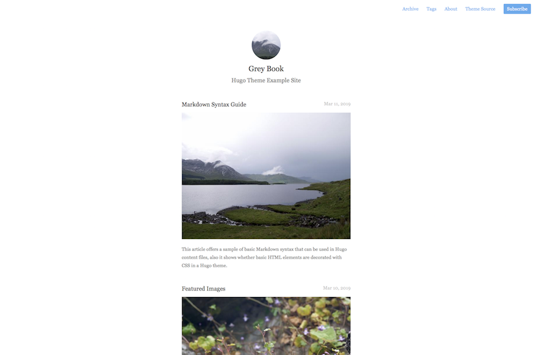

# Hugo Grey Book Theme

A simple, blog focused theme for the sophisticated reader and blogger with ideas above their station. 



- [Example Site Source](https://grey-book-theme-example.onrender.com)

Features:

- Archive
- Tags
- Org Mode friendly
- Featured Images in post summary
- A long, warm, rich aftertaste with hints of an autumn bonfire, like a good whisky

## Installation

### As Git Submodule

1. Inside the folder of your Hugo site run:

```bash
$ git submodule add https://github.com/henryleach/hugo-theme-grey-book.git themes/grey-book
```

2. Add the theme's directory to your `config.toml`:

```
theme = "grey-book"
```

For more information read the official [setup guide](//gohugo.io/overview/installing/) of Hugo.

### As a Simple Download

Download the theme as a [zip file](https://github.com/henryleach/hugo-theme-grey-book/archive/refs/heads/main.zip) from Github, then unzip it into a folder `themes/grey-book`.


## Getting started

After installing the theme, you need to update the `config.toml` file in your site's root directory. 


### Configuration

Inside the [`exampleSite`](https://github.com/henryleach/hugo-theme-grey-book/tree/main/exampleSite) folder of this theme is a [`config.toml`](https://github.com/henryleach/hugo-theme-grey-book/blob/master/exampleSite/config.toml) example config file. Copy it to the root directory of your site and change the options as you please.

> ⚠ You will probably need to delete the line: `themesDir = "../../"` which is needed to make the example theme site work.

### Logo and Favicon

Set them to whichever image you like using the parameters. Avatar size is 100x100px.

```
[params]
favicon = "/images/yourfavicon.png"
avatar = "/images/youravatar.png"
roundAvatar = false
```

### Featured Image

Any post can have a featured image set that will be used on the default list page along with the post's summary. Simply add `featured_image = "filename.jpg"` to your post's front matter.

If you are using pageBundles and you don't specify an image, one from the pageBundle will be automatically added. If you specifically _don't_ want to have a featured image, then set featured_image to a none existent filename, e.g.: `featured_image = "none"`.


### Archetypes

Grey Book has two pageBundle archetypes, depending if you want to create a Markdown or Org Mode based post. Either:

```bash
$ hugo new --kind md-post /posts/my-new-post-name
```
or for a Org Mode based post:

```bash
$ hugo new --kind org-post /posts/my-new-post-name
```

## Features Inherited In This Theme

These features existed in the [Mini](https://github.com/henryleach/hugo-theme-grey-book) theme from which this is derived, and haven't been changed, so should still work, but they haven't been tested. 

### Add Comments

To enable comments, add following to your config file:

- Disqus shortname: `disqusShortname: your-disqus-shortname`
- Enable Comment:

    ```yaml
    params:
      enableComments: true
    ```

### Google Analytics

To enable google analytics, add following to your config file:

- Google Analytics ID: `googleAnalytics: your-google-analytics-id`
- Enable Google Analytics:

    ```yaml
    params:
      enableGoogleAnalytics: true
    ```

## License

[MIT](https://github.com/henryleach/hugo-theme-grey-book/blob/main/LICENSE.md)

## Acknowledgements

Forked from Nodejh's [Mini](https://github.com/nodejh/hugo-theme-mini) theme.

