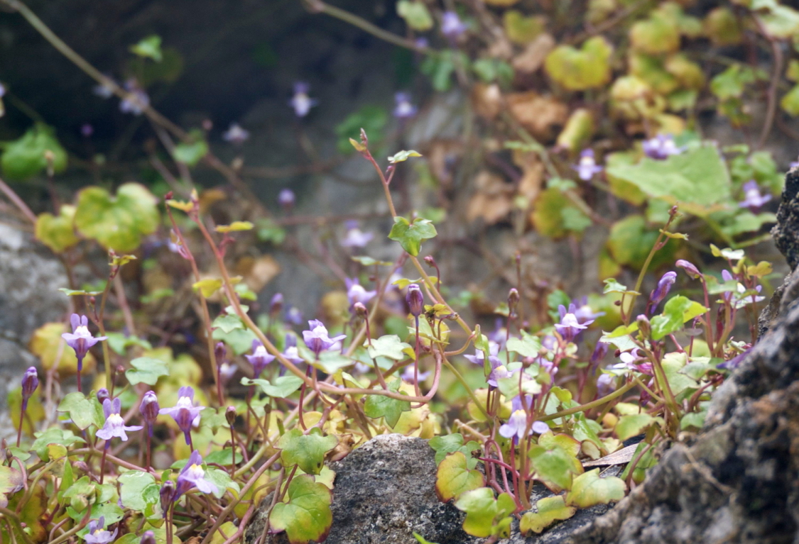

+++
title =  "Featured Images"
date = 2019-03-10T22:55:52+02:00
tags = ["Images", "Theme"]
categories = ["x", "y"]
draft = false
featured_image = "flowers.jpg"
+++



Posts can be assigned a featured image from the pageBundle in the front matter, which is shown with the summary on list pages. If no image is named in the front matter, then one within the pageBundle is selected automatically and used.

<!--more-->

If you specifically don't want to have a featured image, then give the `featured_image` parameter a string value of a picture that doesn't exist, .e.g. "none", as below.

A featured image can be used, even if the picture is not featured within the post itself, it just has to be stored within the pageBundle folder for the post.

```toml
+++
title = "Featured Images"
featured_image = "none"
+++
```


